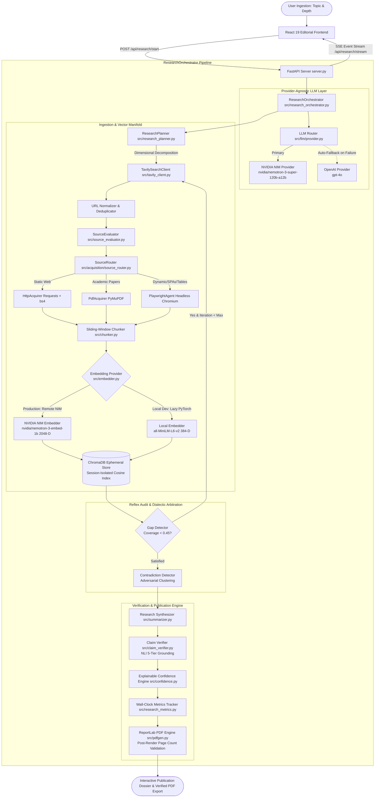

# 🤝 Agentic Research PRO (v2.0)

> **Autonomous Multi-Agent Deep Research & Epistemic Verification Instrument powered by NVIDIA NIM (Nemotron 120B), OpenAI Fallback, Local Hugging Face Embeddings, ChromaDB Vector Retrieval, FastAPI SSE Streaming, and an Editorial React Presentation Engine.**

[](https://www.python.org/)
[](https://fastapi.tiangolo.com/)
[](frontend/)
[](https://build.nvidia.com/)
[](https://openai.com/)
[-brightgreen.svg)](https://huggingface.co/sentence-transformers/all-MiniLM-L6-v2)
[](src/acquisition/)
[-purple.svg)](https://www.trychroma.com/)
[](https://tavily.com/)
[-success.svg)](tests/)
[](#-author--attribution)

---

## 📖 Table of Contents

- [Overview & Value Proposition](#-overview--value-proposition)
- [Key Architectural Innovations](#-key-architectural-innovations)
- [System Architecture Topology](#-system-architecture-topology)
- [Technology Stack: Separation of Concerns](#-technology-stack-separation-of-concerns)
- [Research Depth Modes (Quick vs Standard vs Deep)](#-research-depth-modes)
- [Empirical Benchmark: Traditional Search vs Agentic Research PRO](#-empirical-benchmark)
- [Production API Reference](#-production-api-reference)
- [Directory Structure](#-directory-structure)
- [Installation & Quick Start](#-installation--quick-start)
- [Testing & Quality Assurance](#-testing--quality-assurance)
- [Academic & Methodological Disclaimer](#-academic--methodological-disclaimer)
- [Author & Attribution](#-author--attribution)
- [License](#-license)

---

## 💡 Overview & Value Proposition

Traditional AI search workflows and linear Retrieval-Augmented Generation (RAG) pipelines suffer from critical epistemic flaws:
1. **Single-Query Shallow Sampling**: Searching only the exact user prompt overlooks orthogonal sub-topics, trade-offs, and critical counter-evidence.
2. **Unchecked Hallucinations & Cherry-Picking**: Standard LLMs generate authoritative-sounding text without testing whether individual factual assertions are grounded in retrieved evidence.
3. **Absence of Blindspot Awareness**: Systems synthesize outputs without measuring how much of the intended topical surface area was missed due to search gaps.
4. **Echo-Chamber Synthesis**: Conflicting empirical claims, academic disputes, and opposing technical methodologies are flattened into a single, misleading consensus.
5. **Opaque Grounding**: Readers receive text without transparent citation linkage or explainable confidence metrics.

**Agentic Research PRO** is an enterprise-grade autonomous research platform. It decomposes questions into multi-perspective hypotheses, deploys parallel web crawlers, indexes evidence into a dense vector space with local Hugging Face embeddings, autonomously audits for coverage gaps, clusters adversarial dialectic contradictions, grounds factual assertions via Natural Language Inference (NLI), and compiles publication-grade dossiers with post-render page validation.

---

## 🧠 Key Architectural Innovations

### 1. Dual-Provider LLM Router with Resilient Automatic Fallback
The system uses **NVIDIA NIM** (`nvidia/nemotron-3-super-120b-a12b`) as its high-performance primary reasoning engine via an OpenAI-compatible interface. If NVIDIA encounters network timeouts, rate limits (HTTP 429), or service degradation, the pipeline automatically switches the affected operation to **OpenAI** (`gpt-4o`) seamlessly without breaking the research session.

### 2. Zero-Cost Local Hugging Face Embeddings
All semantic indexing, sliding-window chunking (1,200 chars, 100 overlap), and cosine distance queries are executed locally via `sentence-transformers/all-MiniLM-L6-v2`. LLM inference is strictly reserved for high-order reasoning (planning, synthesis, dialectic debate, and claim extraction), saving substantial token costs.

### 3. Iterative Heuristic Gap Detection & Reflex Loop
The system mathematically evaluates evidence coverage across all planned research dimensions before generating synthesis reports. If dimensional semantic coverage falls below the defensible threshold ($\le 0.45$), it autonomously triggers a follow-up reflex query cycle to retrieve missing perspectives.

### 4. Objective Evidence Grounding (Beyond Cosine Similarity)
Claims are never accepted solely on vector similarity. The top candidate evidence passages are subjected to rigorous Natural Language Inference classification into 5 distinct support tiers:
* **Strongly Supported** ($1.00$)
* **Supported** ($0.85$)
* **Partially Supported** ($0.60$)
* **Weakly Supported** ($0.35$)
* **Unsupported** ($0.10$)

### 5. Adversarial Dialectic Contradiction Engine
In **Deep Mode**, the system actively clusters competing empirical evidence across dimensions to uncover technological debates, cost disputes, and opposing expert conclusions rather than suppressing them.

### 6. Explainable Research Confidence Engine
A transparent composite confidence score ($0 - 100$) is computed mathematically without hallucination:
$$\text{Confidence} = 25\%\,Q_{\text{source}} + 20\%\,C_{\text{evidence}} + 25\%\,S_{\text{claims}} + 15\%\,A_{\text{agreement}} + 15\%\,K_{\text{completeness}}$$

### 7. Autonomous Playwright Research Acquisition Layer
Web evidence ingestion dynamically routes across three specialized acquisition engines via `SourceRouter`:
* **Static HTTP Engine (`HttpAcquirer`)**: High-throughput extraction via Requests and BeautifulSoup, with real-time heuristic detection of client-side dynamic frameworks, empty SPA mounting shells, and low text-to-code ratios.
* **Academic PDF Engine (`PdfAcquirer`)**: High-fidelity streaming extraction via PyMuPDF with size gating (20MB) and page bounding (25 pages).
* **Interactive Browser Agent (`PlaywrightAgent`)**: Headless Chromium instance executing read-only browser exploration. Handles JavaScript-heavy single-page applications, converts HTML tables into structured Markdown preserving column/row semantics for vector embedding, expands collapsible accordion panels (`aria-expanded="false"`, `<details>`), and performs bounded incremental scrolling and pagination. Includes automated fallback to HTTP upon navigation timeouts or bot challenges.

---

## 🗺️ System Architecture Topology



### 🕸️ Interactive Autonomous Investigation Topology (React Flow v12)

The presentation layer includes an interactive 9-node directed graph (`frontend/src/components/AgenticHeroGraph.tsx`) illustrating the active multi-agent pipeline during research execution:

```text
                      [ Query Formulation ] (QUESTION)
                                 │
         ┌───────────────────────┼───────────────────────┐
         ▼                       ▼                       ▼
  [ Economic Impact ]   [ Technical Depth ]   [ Historical Precedent ] (ANGLES 1–3)
         │                       │                       │
         ▼                       ▼                       ▼
  [ Tavily Sources ] ──► [ Playwright Agent ] ──► [ ChromaDB Vectors ] (EVIDENCE TIER)
         │                       │                       │
         └───────────────────────┼───────────────────────┘
                                 ▼
                     [ Claim Verification ] (VERIFY)
                                 │
                                 ▼
                    [ Synthesized Dossier ] (INSIGHT)
```

#### Node Roles & State Telemetry:
* **Query Formulation (`QUESTION`)**: Root inquiry decomposition and hypothesis formulation.
* **Dimensional Angles (`ANGLE 1–3`)**: Multi-perspective query expansion spanning technical, economic, and historical dimensions.
* **Tavily Sources (`SOURCES`)**: Real-time web perception discovering high-authority primary and academic literature.
* **Playwright Agent (`PLAYWRIGHT`)**: Autonomous read-only Chromium browser agent extracting client-rendered DOM content, parsing tabular datasets into Markdown, and expanding hidden accordion sections.
* **ChromaDB Vectors (`EVIDENCE`)**: Session-isolated dense vector space indexing 384-dimensional chunk embeddings.
* **Claim Verification (`VERIFY`)**: Natural Language Inference (NLI) engine scoring candidate claims against retrieved evidence into 5 distinct grounding tiers.
* **Synthesized Dossier (`INSIGHT`)**: Structured multi-section executive report with citations, confidence analytics, and publication PDF export.

---

## ⚡ Technology Stack: Separation of Concerns

| Domain / Responsibility | Technology / Library | Role & Architectural Rationale |
| :--- | :--- | :--- |
| **Presentation Layer** | **React 19 + TypeScript + Vite** | High-performance editorial client with responsive paper-and-ink research aesthetics. |
| **Styling & Motion** | **Tailwind CSS + Framer Motion** | Glassmorphism, smooth micro-interactions, live research progress animation. |
| **Topology Graph** | **@xyflow/react (React Flow v12)** | Interactive directed graph rendering the multi-agent investigation architecture. |
| **Backend API** | **FastAPI + Uvicorn** | Asynchronous HTTP endpoints with Server-Sent Events (SSE) for sub-second telemetry. |
| **Primary Reasoning LLM** | **NVIDIA NIM (Nemotron-3-120B)** | High-throughput structured planning, synthesis, and dialectic reasoning. |
| **Fallback Reasoning LLM** | **OpenAI (`gpt-4o`)** | Autonomous safety net ensuring uninterrupted research execution upon upstream outages. |
| **Semantic Embeddings** | **Hugging Face (`all-MiniLM-L6-v2`)** | 384-dimensional local vector embeddings with zero API costs and SHA256 cache. |
| **Vector Storage** | **ChromaDB (`EphemeralClient`)** | In-memory session-isolated cosine similarity manifold. |
| **Web Perception** | **Tavily Search API** | Multi-query AI search optimized for academic, preprint, and technical sources. |
| **Interactive Acquisition** | **Playwright (`playwright>=1.40.0`)** | Headless Chromium agent for SPA rendering, dynamic tables to Markdown, and accordion expansion. |
| **Document Scraping** | **Requests + PyMuPDF (`pymupdf`)** | Resilient static HTML parsing and native multi-page academic PDF document extraction. |
| **PDF Dossier Generation** | **ReportLab Platypus** | Typographically styled publication reports with post-render physical page count checks. |
| **Legacy Dashboard** | **Streamlit** | Maintained alternative UI supporting standalone single-command execution. |

---

## 📊 Research Depth Modes

| Operating Parameter | Quick Mode | Standard Mode | Deep Mode |
| :--- | :---: | :---: | :---: |
| **Target Search Queries** | 1 focused query | 3 dimensional queries | 6 dimensional queries |
| **Target Web Sources** | 5 sources | 10 sources | 20 sources |
| **Maximum Iterations** | 1 pass | 2 passes | 3 passes |
| **Retrieved Evidence Chunks** | 10 chunks | 20 chunks | 30 chunks |
| **Research Planning** | Deterministic | Multi-Dimensional (NVIDIA) | Comprehensive MECE (NVIDIA) |
| **Gap Detection Reflex Loop** | Disabled | 1 Reflex Cycle | Up to 2 Reflex Cycles |
| **Contradiction Debate** | Disabled | Disabled | Enabled (Adversarial Clustering) |
| **Factual Claims Grounded** | Up to 5 claims | Up to 10 claims | Up to 20 claims |
| **LLM Call Budget** | $\le 3$ calls | $\le 8$ calls | $\le 16$ calls |
| **Source Priority Threshold** | 0.35 | 0.45 | 0.50 |

---

## 📈 Empirical Benchmark

| Feature / Metric | Traditional Web Search | Agentic Research PRO (Standard) | Agentic Research PRO (Deep) |
| :--- | :---: | :---: | :---: |
| **Inquiry Dimensions** | 1 (Shallow / Linear) | 3–4 Dimensions | 5–7 Dimensions |
| **Source Priority Scoring** | ❌ None (PageRank only) | ✅ 5-Factor Heuristic | ✅ Strict Domain/Recency Filter |
| **Autonomous Reflex Correction** | ❌ None | ✅ 1 Iterative Cycle | ✅ Up to 2 Iterative Cycles |
| **Vector Evidence Chunks** | 0 (Raw search snippets) | 15–25 Dense Chunks | 35–60 Dense Chunks |
| **Claim Grounding (NLI)** | ❌ None (0%) | ✅ 10 Claims Grounded | ✅ 20 Claims Grounded |
| **Contradiction Reconciliation** | ❌ Ignored | ❌ Ignored | ✅ Synthesized Tension Matrix |
| **Confidence Scoring** | ❌ None | ✅ 5-Factor Heuristic | ✅ 5-Factor Heuristic |
| **Document Delivery** | Unformatted text | Publication Dossier + PDF | Verified Deep PDF Dossier |

---

## 🔌 Production API Reference

The FastAPI server provides asynchronous endpoints with Server-Sent Events (SSE) streaming:

### 1. Health & LLM Status
```http
GET /api/health/llm
```
**Response:**
```json
{
  "primary": {
    "provider": "NVIDIA",
    "model": "nvidia/nemotron-3-super-120b-a12b",
    "configured": true,
    "reachable": true,
    "error": null
  },
  "fallback": {
    "provider": "OpenAI",
    "model": "gpt-4o",
    "configured": true,
    "reachable": true,
    "error": null
  },
  "active_provider": "NVIDIA",
  "session_id": "default"
}
```

### 2. Initiate Research Session
```http
POST /api/research/start
Content-Type: application/json

{
  "topic": "What are the major limitations of solid-state batteries for electric vehicles as of 2026?",
  "depth": "STANDARD"
}
```
**Response:**
```json
{
  "session_id": "res_a1b2c3d4e5f6",
  "status": "started",
  "topic": "What are the major limitations of solid-state batteries for electric vehicles as of 2026?",
  "depth": "STANDARD"
}
```

### 3. Real-Time Telemetry Stream (SSE)
```http
GET /api/research/stream/{session_id}
```
Emits Server-Sent Events with wall-clock event timestamps and stage updates:
```text
data: {"type": "stage", "stage": "PLANNING", "message": "Decomposing research query into dimensional angles..."}
data: {"type": "event", "event": {"id": "evt_1", "stage": "PLANNING", "title": "Angles Formulated", "elapsed": "00:03"}}
data: {"type": "complete", "session_id": "res_a1b2c3d4e5f6"}
```

### 4. Fetch Structured Dossier
```http
GET /api/research/result/{session_id}
```

### 5. Download Verified Publication PDF
```http
GET /api/research/download-pdf/{session_id}
```

---

## 📁 Directory Structure

```text
Agentic-Resarch-Pro/
├── .env.example                       # Environment configuration template
├── README.md                          # Comprehensive technical documentation
├── requirements.txt                   # Python core dependencies
├── server.py                          # Production FastAPI backend + SSE bridge
├── app.py                             # Classic Streamlit research dashboard
├── pytest.ini                         # Pytest configuration
│
├── src/                               # Core Python Intelligence Engine
│   ├── config.py                      # Presets, limits, and runtime settings
│   ├── research_orchestrator.py       # Master multi-agent pipeline coordinator
│   ├── research_planner.py            # Dimensional multi-query decomposition
│   ├── tavily_client.py               # AI search client with deduplication
│   ├── source_evaluator.py            # 5-factor source quality scoring
│   ├── scraper.py                     # Backward-compatible scraper façade
│   ├── cleaner.py                     # Unicode and tag sanitization
│   ├── chunker.py                     # Sliding-window text chunker
│   ├── embedder.py                    # Local Hugging Face sentence-transformers
│   ├── chroma_store.py                # Ephemeral ChromaDB vector manifold
│   ├── gap_detector.py                # Semantic coverage audit & reflex query
│   ├── contradiction_detector.py      # Adversarial dialectic conflict clustering
│   ├── claim_verifier.py              # Atomic NLI claim verification
│   ├── summarizer.py                  # Structured dossier synthesis
│   ├── confidence.py                  # Explainable 5-component confidence heuristic
│   ├── research_metrics.py            # Wall-clock timer and execution metrics
│   ├── pdfgen.py                      # ReportLab PDF generator & page validator
│   │
│   ├── acquisition/                   # Multi-Engine Autonomous Acquisition Layer
│   │   ├── __init__.py                # Package exports & public API
│   │   ├── evidence_document.py       # Unified ScrapedDocument / EvidenceDocument
│   │   ├── source_router.py           # Multi-engine routing & dynamic fallback
│   │   ├── http_acquirer.py           # Requests + bs4 + dynamic signal detector
│   │   ├── pdf_acquirer.py            # Academic streaming PyMuPDF extractor
│   │   └── playwright_agent.py        # Headless Chromium agent (tables, accordions, scroll)
│   │
│   ├── llm/                           # Provider-Agnostic LLM Layer
│   │   ├── __init__.py                # LLM factory and provider routing
│   │   ├── provider.py                # Abstract LLMProvider interface
│   │   ├── nvidia_provider.py         # NVIDIA NIM Nemotron-3-120B provider
│   │   └── openai_provider.py         # OpenAI GPT-4o fallback provider
│   │
│   └── ui/                            # Streamlit Presentation Components
│       ├── theme.py                   # Styling tokens and CSS injects
│       ├── components.py              # Visual cards and widgets
│       ├── research_progress.py       # Progress bars and live state display
│       └── results_view.py            # Dossier tabs and inspection panels
│
├── frontend/                          # Production React Presentation Layer
│   ├── package.json                   # React 19, Vite, Tailwind, Framer Motion
│   ├── tailwind.config.js             # Research design tokens and palettes
│   ├── vite.config.ts                 # Build configuration with proxy
│   ├── dist/                          # Compiled static bundle served by FastAPI
│   └── src/
│       ├── App.tsx                    # Top-level screen coordinator
│       ├── components/
│       │   ├── AgenticHeroGraph.tsx   # Interactive 9-node multi-agent topology (Playwright integration)
│       │   ├── ResearchComposer.tsx   # Command surface with depth selector
│       │   ├── LiveResearchTrail.tsx  # Wall-clock live timeline & event feed
│       │   ├── ContinuousDossierView.tsx # Publication dossier & claim matrix
│       │   └── WhyDifferentModal.tsx  # Architectural comparative modal
│       └── types/
│           └── research.ts            # TypeScript data contracts & schemas
│
└── tests/                             # Comprehensive Test Suite (85 tests)
    ├── test_acquisition.py            # Multi-engine routing & Playwright browser tests
    ├── test_llm_provider.py           # NVIDIA provider & automatic fallback tests
    ├── test_server.py                 # FastAPI endpoints & SSE stream tests
    ├── test_chroma_store.py           # Vector manifold isolation & retrieval
    ├── test_claim_verifier.py         # Claim extraction & NLI grounding tests
    ├── test_contradiction_detector.py # Adversarial clustering tests
    ├── test_gap_detector.py           # Semantic coverage & follow-up tests
    ├── test_embedder.py               # Hugging Face embeddings & cache tests
    ├── test_pdfgen.py                 # ReportLab generation & page count tests
    └── ...                            # Full unit & end-to-end coverage
```

---

## 🚀 Installation & Quick Start

### 1. System Requirements
* **Python**: `3.10` or `3.11+`
* **Node.js**: `18+` (only required if modifying the React frontend)
* **API Keys**:
  * `NVIDIA_API_KEY` (Free tier available on [NVIDIA Build](https://build.nvidia.com/))
  * `OPENAI_API_KEY` (Required for automatic fallback safety net)
  * `TAVILY_API_KEY` (Web search API key from [Tavily](https://tavily.com/))

### 2. Clone & Environment Setup
```bash
# Clone the repository
git clone https://github.com/JustXutkarsh/Agentic-Resarch-Pro.git
cd Agentic-Resarch-Pro

# Create virtual environment
python3 -m venv venv
source venv/bin/activate  # Windows: venv\Scripts\activate

# Install Python dependencies & Playwright browser runtime
pip install -r requirements.txt
playwright install chromium
```

### 3. Configure Environment Variables
Copy `.env.example` to `.env` and provide your credentials:
```bash
cp .env.example .env
```
Edit `.env`:
```env
# Primary LLM Provider: NVIDIA NIM (Nemotron 120B)
NVIDIA_API_KEY=nvapi-xxxxxxxxxxxxxxxxxxxxxxxxxxxxxx
NVIDIA_BASE_URL=https://integrate.api.nvidia.com/v1
NVIDIA_MODEL=nvidia/nemotron-3-super-120b-a12b
LLM_PROVIDER=nvidia

# Embedding Provider: "nvidia" (remote NIM API, 2048-dim, recommended for 512MB RAM) or "local" (MiniLM, 384-dim)
EMBEDDING_PROVIDER=nvidia
NVIDIA_EMBEDDING_MODEL=nvidia/nemotron-3-embed-1b
EMBEDDING_BATCH_SIZE=16

# Fallback LLM Provider (Safety Net)
OPENAI_API_KEY=sk-proj-xxxxxxxxxxxxxxxxxxxxxxxxxxxx
OPENAI_MODEL=gpt-4o

# Real-Time Web Search API
TAVILY_API_KEY=tvly-xxxxxxxxxxxxxxxxxxxxxxxxxxxxxxx

# Interactive Research Acquisition Agent (Playwright)
PLAYWRIGHT_ENABLED=true
PLAYWRIGHT_HEADLESS=true
PLAYWRIGHT_MAX_PAGES=3
PLAYWRIGHT_MAX_SCROLLS=5
PLAYWRIGHT_TIMEOUT_MS=15000
```

### 4. Run the Production Application
Launch the unified FastAPI server (which automatically serves the compiled React interface):
```bash
python server.py
```
Open your browser at **`http://localhost:8000`**.

*(Optional) To run the Streamlit dashboard instead:*
```bash
streamlit run app.py
```

### 5. Production Cloud Deployment: Vercel (Frontend) + Render (Backend)

The application supports a modern split cloud architecture:
* **Frontend (Vercel)**: React 19 + Vite static SPA deployed from the `frontend/` directory with automatic client-side SPA routing (`vercel.json`).
* **Backend (Render)**: Dockerized FastAPI server providing SSE live research streams, ReportLab PDF dossier generation, Ephemeral ChromaDB vector manifold, SentenceTransformers, Playwright Chromium headless acquisition, and NVIDIA NIM primary (Nemotron 120B) with automatic OpenAI fallback.

#### Vercel Frontend Setup:
1. Connect your GitHub repository to Vercel.
2. Set **Root Directory** to `frontend`.
3. Set **Framework Preset** to `Vite`.
4. Configure Environment Variable:
   ```env
   VITE_API_BASE_URL=https://YOUR-RENDER-SERVICE.onrender.com
   ```

#### Render Backend Setup:
1. Deploy as a **Web Service** using the root `Dockerfile` (or connect using the included `render.yaml` Blueprint).
2. Configure **Health Check Path** to `/health`.
3. Configure Environment Variables:
   ```env
   CORS_ALLOW_ORIGINS=https://YOUR-VERCEL-APP.vercel.app
   NVIDIA_API_KEY=nvapi-xxxxxxxxxxxxxxxxxxxxxxxxxxxxxx
   OPENAI_API_KEY=sk-proj-xxxxxxxxxxxxxxxxxxxxxxxxxxxx
   TAVILY_API_KEY=tvly-xxxxxxxxxxxxxxxxxxxxxxxxxxxxxxx
   PLAYWRIGHT_ENABLED=true
   PLAYWRIGHT_HEADLESS=true
   ```

### 6. Single-Container Docker Deployment (Alternative)
Build and run the unified container locally or on any container platform:
```bash
# Build multi-stage Docker image
docker build -t agentic-research-pro .

# Run container with environment configuration
docker run -p 8000:8000 --env-file .env agentic-research-pro
```

### 7. (Optional) Frontend Development Mode
If you wish to edit the React frontend with live hot-module replacement (HMR):
```bash
cd frontend
npm install
npm run dev
```
The Vite dev server will proxy API requests to `http://localhost:8000`.

---

## 🧪 Testing & Quality Assurance

The codebase maintains a 100% pass rate across **118 automated tests**:

```bash
# Run all tests
pytest tests/ -v
```

### Test Suite Coverage:
* `tests/test_acquisition.py`: Source routing, Playwright dynamic extraction, Markdown table generation, accordion expansion, bounded scrolling/pagination, HTTP fallback (18 tests).
* `tests/test_nvidia_embedder.py`: NVIDIA remote embedding provider, bounded batching, order preservation, query/passage mode isolation, rate limit backoff (429), non-retryable auth (401), dimension enforcement, lazy import verification (11 tests).
* `tests/test_llm_provider.py`: NVIDIA NIM routing, OpenAI fallback, error recovery (9 tests).
* `tests/test_server.py`: FastAPI health endpoints, session creation, SSE streaming (4 tests).
* `tests/test_config.py`: Operational parameters, budgets, depth profiles (4 tests).
* `tests/test_embedder.py`: Local SentenceTransformer model loader, SHA256 caching, batching (6 tests).
* `tests/test_chroma_store.py`: Session and model namespace isolation, cosine similarity retrieval (4 tests).
* `tests/test_research_planner.py`: Multi-perspective dimensional planning (4 tests).
* `tests/test_tavily_client.py`: Multi-query deduplication and query caching (6 tests).
* `tests/test_source_evaluator.py`: 5-factor source quality scoring (5 tests).
* `tests/test_scraper.py`: HTML scraping and PyMuPDF document extraction (4 tests).
* `tests/test_gap_detector.py`: Semantic coverage and reflex loop generation (5 tests).
* `tests/test_claim_verifier.py`: Atomic extraction and NLI support classification (3 tests).
* `tests/test_contradiction_detector.py`: Dialectic evidence clustering and tension checks (3 tests).
* `tests/test_confidence.py`: Mathematical 5-factor weighting and explanations (3 tests).
* `tests/test_research_metrics.py`: Wall-clock timing and counters (1 test).
* `tests/test_research_orchestrator.py`: Full orchestration cycle with callbacks (1 test).
* `tests/test_pdfgen.py`: ReportLab layout, table formatting, and page validation (2 tests).
* `tests/test_pdf_unicode.py`: Technical symbols, math notations, and Unicode formatting (3 tests).
* `tests/test_evidence_integrity.py`: Claim preservation, metadata filtering, table chunking (6 tests).
* `tests/test_deployment.py`: Production health endpoints, CORS regex matching, memory bound assertions (10 tests).
* `tests/test_end_to_end.py`: Multi-depth operational hierarchies (3 tests).

---

## ⚖️ Academic & Methodological Disclaimer

> **The Research Confidence Score is an algorithmic heuristic derived from source quality heuristics, semantic evidence coverage, claim verification ratios, source consensus, and dimensional completeness. It is intended to assist human synthesis and does not substitute for independent peer-reviewed domain validation.**

---

## 👤 Author & Attribution

* **Built by**: **Utkarsh Pandey**
* **Repository**: [JustXutkarsh/Agentic-Resarch-Pro](https://github.com/JustXutkarsh/Agentic-Resarch-Pro)

---

## 📄 License

This project is licensed under the [MIT License](LICENSE).
