# 🤝 Agentic Research PRO (v2.0)

> **Autonomous Multi-Agent Deep Research & Evidence Verification Pipeline powered by Local Hugging Face Embeddings, ChromaDB Vector Retrieval, GPT-4o Reasoning, and Publication-Ready PDF Dossier Export.**

[](https://www.python.org/)
[](https://streamlit.io/)
[](https://openai.com/)
[](https://huggingface.co/sentence-transformers/all-MiniLM-L6-v2)
[](https://www.trychroma.com/)
[](https://tavily.com/)
[-success.svg)](tests/)

---

## 📖 Table of Contents

- [The Problem with Traditional Research](#-the-problem-with-traditional-research)
- [The Agentic Research PRO Solution](#-the-agentic-research-pro-solution)
- [Key Architectural Innovations](#-key-architectural-innovations)
- [System Architecture Flow](#-system-architecture-flow)
- [Technology Stack: Separation of Concerns](#-technology-stack-separation-of-concerns)
- [Research Depth Comparison (Quick vs Standard vs Deep)](#-research-depth-comparison)
- [Benchmark: Traditional Search vs Agentic Research PRO](#-benchmark-traditional-search-vs-agentic-research-pro)
- [Component & Module Breakdown](#-component--module-breakdown)
- [Directory Structure](#-directory-structure)
- [Installation & Quick Start](#-installation--quick-start)
- [Testing & Quality Assurance](#-testing--quality-assurance)
- [Academic Disclaimer](#-academic-disclaimer)
- [License](#-license)

---

## 🛑 The Problem with Traditional Research

Traditional automated research workflows suffer from fundamental weaknesses:
1. **Single-Query Blindspots**: Searching only the exact user prompt misses critical adjacent sub-topics, regulatory frameworks, and market trade-offs.
2. **Unchecked Hallucinations**: Standard RAG pipelines generate text without verifying if individual factual assertions are supported by underlying evidence.
3. **No Coverage Awareness**: LLMs synthesize summaries without knowing which dimensions of a topic were missed due to search blindspots.
4. **Source Quality Agnosticism**: Search engines return blogs, promotional content, and academic papers with equal weight.
5. **Opaque Confidence**: Users are presented with authoritative-sounding text without any explanation of empirical grounding or data consensus.

---

## 💡 The Agentic Research PRO Solution

**Agentic Research PRO** is an end-to-end semi-autonomous multi-agent system designed to overcome these limitations. Instead of a linear prompt wrapper, it orchestrates a team of specialized sub-agents:

* **Decomposes** broad topics into multidimensional research questions and targeted queries.
* **Searches & Normalizes** sources across multiple queries with URL deduplication and query caching.
* **Evaluates** source priority using a 5-factor heuristic (Authority 30%, Relevance 25%, Recency 20%, Evidence Quality 15%, Reputation 10%).
* **Indexes & Retrieves** evidence using **local Hugging Face embeddings** (`all-MiniLM-L6-v2`) in isolated ChromaDB session collections (**zero OpenAI embedding API cost**).
* **Detects Gaps** deterministically by measuring semantic coverage across dimensions and formulating iterative follow-up queries.
* **Grounds Claims** through GPT-4o factual verification against retrieved evidence passages (classifying claims into 5 rigorous support tiers).
* **Analyzes Contradictions** between research dimensions to highlight competing viewpoints.
* **Calculates an Explainable Confidence Heuristic** and compiles everything into a publication-ready PDF dossier.

---

## 🧠 Key Architectural Innovations

### 1. Zero OpenAI Embedding Overhead
All document chunking, indexing, semantic similarity, and retrieval operations use local `sentence-transformers/all-MiniLM-L6-v2`. OpenAI is called **strictly for high-level language intelligence and reasoning** (planning, claim extraction, evidence interpretation, report synthesis).

### 2. Evidence Grounding (Not Cosine Similarity Alone)
Claims are **never verified by cosine similarity alone**. Cosine similarity is used strictly to identify candidate evidence passages (top 3–5 chunks). GPT-4o then performs objective evidentiary judgment to categorize each claim:
* `Strongly Supported` (1.0)
* `Supported` (0.85)
* `Partially Supported` (0.60)
* `Weakly Supported` (0.35)
* `Unsupported` (0.10)

### 3. Iterative Research with Deterministic Gap Detection
Before calling LLMs for gap analysis, the system computes the mathematical semantic similarity between evidence chunks and planned research dimensions. If coverage falls below threshold, focused follow-up queries are generated for subsequent search iterations, strictly capped by `max_iterations`.

### 4. Explainable Research Confidence Engine
The system synthesizes an explainable score ($0 - 100$):
$$\text{Confidence} = 25\%\text{ Source Quality} + 20\%\text{ Evidence Coverage} + 25\%\text{ Claim Support} + 15\%\text{ Source Agreement} + 15\%\text{ Research Completeness}$$
A transparent plain-English diagnostic summary is generated algorithmically without an additional LLM call.

---

## 🗺️ System Architecture Flow

```mermaid
flowchart TD
    User([User Topic & Depth Selection]) --> UI[Streamlit UI app.py]
    UI --> Orchestrator[ResearchOrchestrator src/research_orchestrator.py]
    
    subgraph Planning & Search
        Orchestrator --> Planner[ResearchPlanner src/research_planner.py]
        Planner -->|Dimensions & Queries| TavilyClient[TavilySearch src/tavily_client.py]
        TavilyClient -->|Multi-Query Execution| Deduplicator[URL Normalizer & Deduplicator]
    end

    subgraph Evaluation & Processing
        Deduplicator --> Evaluator[SourceEvaluator src/source_evaluator.py]
        Evaluator -->|Filtered Sources| Scraper[Robust Scraper src/scraper.py + cleaner.py]
        Scraper --> Chunker[Sliding Window Chunker src/chunker.py]
        Chunker --> HFEmbedder[HuggingFace Embedder src/embedder.py\nall-MiniLM-L6-v2]
        HFEmbedder --> ChromaStore[ChromaDB Ephemeral Client src/chroma_store.py]
    end

    subgraph Iterative Loop
        ChromaStore --> Retriever[Semantic Evidence Retrieval]
        Retriever --> GapDetector{Gap Detector src/gap_detector.py\nCoverage < 0.45?}
        GapDetector -->|Yes & Iteration < Max| TavilyClient
        GapDetector -->|Coverage Met or Max Iter| Synthesizer[Report Synthesizer src/summarizer.py]
    end

    subgraph Verification & Export
        Synthesizer --> ClaimVerifier[Claim Verifier src/claim_verifier.py\nExtract & Ground Claims]
        ClaimVerifier --> ContradictionDetector[Contradiction Detector src/contradiction_detector.py\nDEEP Mode]
        ContradictionDetector --> ConfidenceEngine[Confidence Engine src/confidence.py]
        ConfidenceEngine --> MetricsTracker[Metrics Tracker src/research_metrics.py]
        MetricsTracker --> PDFExport[ReportLab PDF Generator src/pdfgen.py]
    end

    PDFExport --> Output([Interactive UI Tabs & Downloadable research_report.pdf])
```



---

## ⚡ Technology Stack: Separation of Concerns

| Task / Responsibility | Technology / Model | Rationale |
| :--- | :--- | :--- |
| **Reasoning & Planning** | OpenAI `gpt-4o` | Complex decomposition, nuance, synthesis |
| **Semantic Embeddings** | `sentence-transformers/all-MiniLM-L6-v2` | Zero API cost, fast local inference, 384-d |
| **Vector Storage & Retrieval** | ChromaDB (`EphemeralClient`) | Session-isolated in-memory cosine index |
| **Web Search** | Tavily Search API | AI-optimized search queries & metadata |
| **Text Sanitization** | `BeautifulSoup4` + `unicodedata` | Script/style stripping, NFKD normalization |
| **Document Scraping** | `requests` + `PyMuPDF` (`pymupdf`) | Robust HTML and PDF document ingestion |
| **Frontend UI** | Streamlit | Lightweight reactive dashboard |
| **PDF Dossier Export** | ReportLab Platypus | Professional typographic reports with tables & links |

---

## 📊 Research Depth Comparison

The system enforces distinct operational parameters based on the selected depth mode:

| Feature / Parameter | Quick Mode | Standard Mode | Deep Mode |
| :--- | :---: | :---: | :---: |
| **Target Search Queries** | 1 focused query | 3 focused queries | 6 focused queries |
| **Target Web Sources** | 5 sources | 10 sources | 20 sources |
| **Maximum Research Iterations** | 1 iteration | 2 iterations | 3 iterations |
| **Retrieved Evidence Chunks ($K$)** | 10 chunks | 20 chunks | 30 chunks |
| **Research Planning** | Minimal / Deterministic | GPT-4o Multidimensional | GPT-4o Comprehensive |
| **Gap Detection & Follow-ups** | Disabled | 1 follow-up analysis | Up to 2 follow-up analyses |
| **Contradiction Analysis** | Disabled | Disabled | Enabled (Evidence Clustering) |
| **Factual Claims Grounded** | Up to 5 claims | Up to 10 claims | Up to 20 claims |
| **Max LLM Calls Budget** | $\le 3$ calls | $\le 8$ calls | $\le 16$ calls |
| **Source Priority Threshold** | 0.35 | 0.45 | 0.50 |

---

## 📈 Benchmark: Traditional Search vs Agentic Research PRO

Empirical comparison between traditional single-query search tools and Agentic Research PRO on identical technical topics:

| Evaluation Metric | Traditional Search | Agentic Research PRO (Standard) | Agentic Research PRO (Deep) |
| :--- | :---: | :---: | :---: |
| **Search Queries Generated** | 1 | 3 | 6 |
| **Unique Sources Evaluated** | 5 | 10–14 | 18–25 |
| **Low-Quality Sources Filtered** | 0 (None) | Yes (Heuristic Filter) | Yes (Strict Filter) |
| **Research Dimensions Covered** | 1 (Shallow) | 3–4 Dimensions | 5–7 Dimensions |
| **Iterative Gap Correction** | ❌ None | ✅ 1 Iteration Loop | ✅ Up to 2 Iteration Loops |
| **Vector Evidence Passages** | 0 (Raw snippets) | 15–25 Chunks | 35–60 Chunks |
| **Factual Claims Verified** | 0% | 10 Claims Grounded | 20 Claims Grounded |
| **Empirical Contradictions** | ❌ Ignored | ❌ Ignored | ✅ Synthesized & Reconciled |
| **Explainable Confidence Heuristic** | ❌ None | ✅ 5-Component Score | ✅ 5-Component Score |
| **PDF Dossier Export** | Simple text dump | Structured Dossier | Publication-Quality Dossier |

---

## 📁 Component & Module Breakdown

* [`src/config.py`](file:///Users/utkarsh/Downloads/Agentic-Resarch-Pro-main/src/config.py): Dataclass presets (`QUICK`, `STANDARD`, `DEEP`) and LLM budgets.
* [`src/embedder.py`](file:///Users/utkarsh/Downloads/Agentic-Resarch-Pro-main/src/embedder.py): Singleton Hugging Face sentence-transformer with SHA256 vector cache.
* [`src/chroma_store.py`](file:///Users/utkarsh/Downloads/Agentic-Resarch-Pro-main/src/chroma_store.py): In-memory ChromaDB vector store with session isolation and cosine space.
* [`src/research_planner.py`](file:///Users/utkarsh/Downloads/Agentic-Resarch-Pro-main/src/research_planner.py): Topic decomposition into sub-questions, dimensions, and search queries.
* [`src/tavily_client.py`](file:///Users/utkarsh/Downloads/Agentic-Resarch-Pro-main/src/tavily_client.py): Multi-query client with query caching and canonical URL deduplication.
* [`src/source_evaluator.py`](file:///Users/utkarsh/Downloads/Agentic-Resarch-Pro-main/src/source_evaluator.py): 5-factor priority scoring with neutral fallback for missing dates.
* [`src/scraper.py`](file:///Users/utkarsh/Downloads/Agentic-Resarch-Pro-main/src/scraper.py): Non-blocking HTML and PyMuPDF document scraping with cleaner integration.
* [`src/chunker.py`](file:///Users/utkarsh/Downloads/Agentic-Resarch-Pro-main/src/chunker.py): Sliding-window character chunking (1200 chars, 100 overlap).
* [`src/gap_detector.py`](file:///Users/utkarsh/Downloads/Agentic-Resarch-Pro-main/src/gap_detector.py): Semantic coverage evaluation and follow-up query formulation.
* [`src/summarizer.py`](file:///Users/utkarsh/Downloads/Agentic-Resarch-Pro-main/src/summarizer.py): Structured markdown report synthesis using GPT-4o.
* [`src/claim_verifier.py`](file:///Users/utkarsh/Downloads/Agentic-Resarch-Pro-main/src/claim_verifier.py): Atomic claim extraction and batched evidence support classification.
* [`src/contradiction_detector.py`](file:///Users/utkarsh/Downloads/Agentic-Resarch-Pro-main/src/contradiction_detector.py): Dimension-based evidence clustering and disagreement discovery.
* [`src/confidence.py`](file:///Users/utkarsh/Downloads/Agentic-Resarch-Pro-main/src/confidence.py): Weighted 5-component confidence heuristic and diagnostic summary.
* [`src/research_metrics.py`](file:///Users/utkarsh/Downloads/Agentic-Resarch-Pro-main/src/research_metrics.py): Real-time counter tracker and provenance metadata.
* [`src/research_orchestrator.py`](file:///Users/utkarsh/Downloads/Agentic-Resarch-Pro-main/src/research_orchestrator.py): Central pipeline coordinator managing state and callbacks.
* [`src/pdfgen.py`](file:///Users/utkarsh/Downloads/Agentic-Resarch-Pro-main/src/pdfgen.py): ReportLab PDF dossier generation.
* [`src/ui/theme.py`](file:///Users/utkarsh/Downloads/Agentic-Resarch-Pro-main/src/ui/theme.py): Apple-inspired Liquid Glass design tokens, ambient background animations, and glassmorphism styling.
* [`src/ui/components.py`](file:///Users/utkarsh/Downloads/Agentic-Resarch-Pro-main/src/ui/components.py): Reusable UI components (hero command bar, segmented depth selector, claim grounding cards, contradiction splits, confidence breakdown bars, gap coverage visualization, and methodology pipeline).
* [`src/ui/research_progress.py`](file:///Users/utkarsh/Downloads/Agentic-Resarch-Pro-main/src/ui/research_progress.py): Live research command center, typewriter activity terminal, glowing SVG research flow, and agent status grid.
* [`src/ui/results_view.py`](file:///Users/utkarsh/Downloads/Agentic-Resarch-Pro-main/src/ui/results_view.py): Multi-tab research workspace (Executive Dossier, Claim Grounding, Methodology, Gap Coverage, Contradictions, Confidence Engine, Source Explorer, and PDF Export).
* [`app.py`](file:///Users/utkarsh/Downloads/Agentic-Resarch-Pro-main/app.py): Application entry point orchestrating the command center and telemetry.

---

## 🚀 Installation & Quick Start

### 1. Prerequisites
* Python 3.10 or 3.11+
* OpenAI API Key (for GPT-4o reasoning)
* Tavily API Key (for real-time web search)

### 2. Environment Setup
```bash
# Clone the repository
git clone https://github.com/JustXutkarsh/Agentic-Resarch-Pro.git
cd Agentic-Resarch-Pro

# Create and activate virtual environment
python3 -m venv venv
source venv/bin/activate  # Windows: venv\Scripts\activate

# Install dependencies
pip install -r requirements.txt
```

### 3. API Key Configuration
Create a `.env` file in the root directory:
```env
OPENAI_API_KEY=sk-proj-xxxxxxxxxxxxxxxxxxxx
TAVILY_API_KEY=tvly-xxxxxxxxxxxxxxxxxxxx
```
*(Alternatively, enter them directly into the Streamlit sidebar during your session).*

### 4. Run the Streamlit Application
```bash
./venv/bin/streamlit run app.py
```
Open **`http://localhost:8501`** in your browser.

---

## 🧪 Testing & Quality Assurance

The project includes an extensive test suite covering every module with unit and end-to-end integration tests:

```bash
# Run all 54 tests
./venv/bin/pytest tests/
```

### Test Suite Summary:
* `tests/test_config.py`: Verifies parameters, presets, and model constants (4 tests).
* `tests/test_embedder.py`: Tests singleton model loading, SHA256 cache, dimensions, batching (6 tests).
* `tests/test_chroma_store.py`: Tests session isolation, metadata storage, cosine ranking (4 tests).
* `tests/test_research_planner.py`: Tests query decomposition, depth limits, fallback handling (4 tests).
* `tests/test_tavily_client.py`: Tests URL normalization, deduplication, query caching (6 tests).
* `tests/test_source_evaluator.py`: Tests domain authority, recency fallback, evidence scoring (5 tests).
* `tests/test_scraper.py`: Tests HTML parsing, cleaner integration, fault tolerance (4 tests).
* `tests/test_gap_detector.py`: Tests dimension coverage calculation and follow-up loops (5 tests).
* `tests/test_claim_verifier.py`: Tests claim prioritization, retrieval, support classification (3 tests).
* `tests/test_contradiction_detector.py`: Tests evidence clustering, tension identification (3 tests).
* `tests/test_confidence.py`: Tests mathematical weighting, bound enforcement, explanations (3 tests).
* `tests/test_research_metrics.py`: Tests real execution counters and timestamping (1 test).
* `tests/test_research_orchestrator.py`: Tests end-to-end orchestration and callbacks (1 test).
* `tests/test_pdfgen.py`: Tests ReportLab document generation, table formatting, and styling (2 tests).
* `tests/test_end_to_end.py`: Tests Quick vs Deep operational hierarchy and benchmark profiles (3 tests).

**Result:** `54 passed in 17.73s` (100% pass rate).

---

## ⚖️ Academic Disclaimer

> **Research Confidence is a system-generated heuristic based on evidence coverage, source prioritization, claim support, source agreement, and research completeness. It does not represent objective scientific certainty or independently verified truth.**

---

## 📄 License

This project is licensed under the [MIT License](LICENSE).
